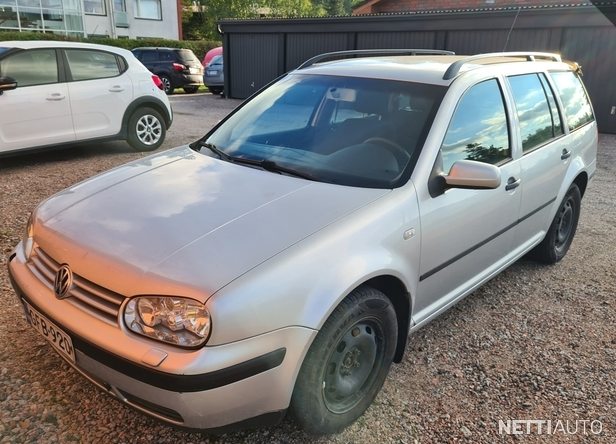
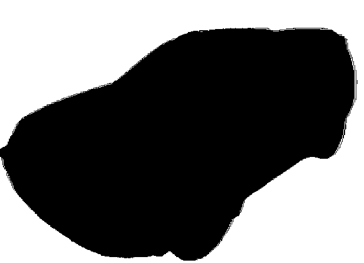
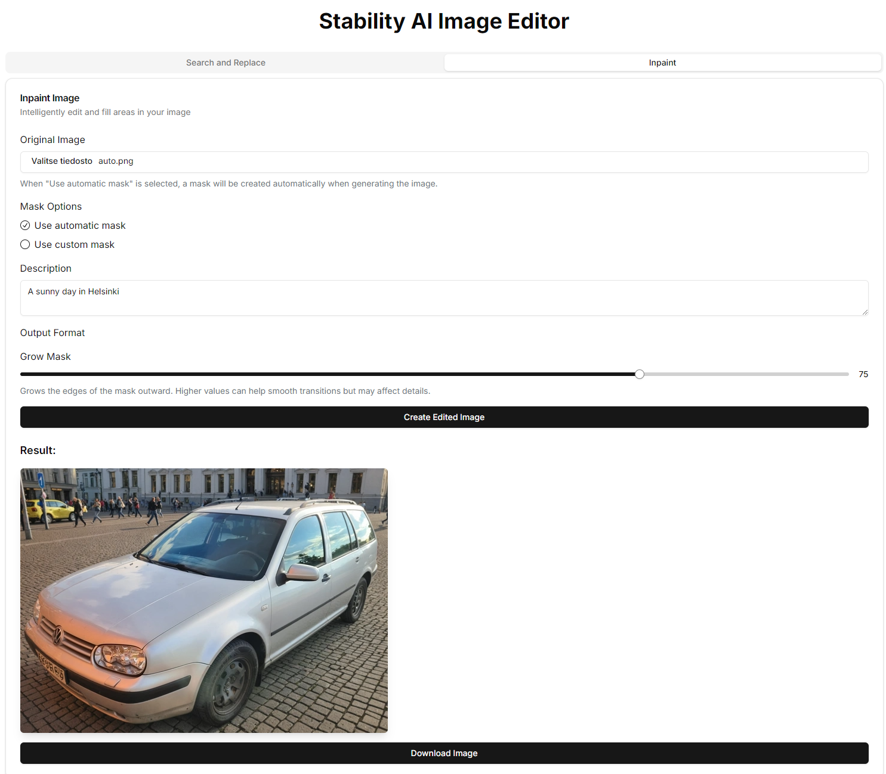
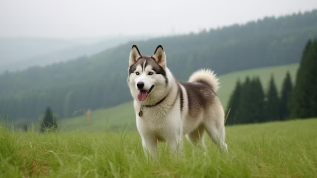
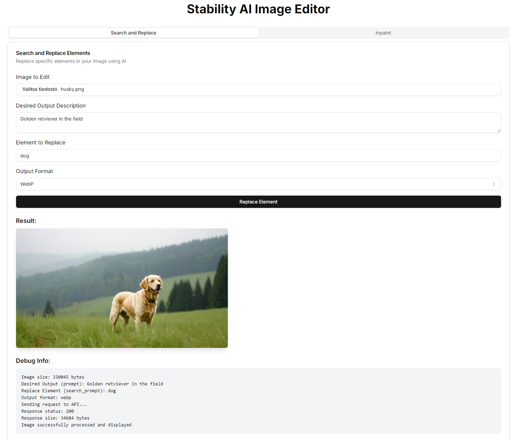

# AI Image Editor

This project enables intelligent image editing using artificial intelligence powered by the Stability AI API. The application offers two powerful featu   - Create a `.env.local` file in the project root directory
   - Add the following lines:

     ```bash
     NEXT_PUBLIC_STABILITY_API_KEY=your_stability_ai_api_key
     FASTAPI_URL=http://localhost:8000/
     ```*Background Modification** and **Search and Replace** functionality.

## How It Works

### Background Modification

1. The user uploads an original image.
2. The user can choose automatic mask creation or upload their own mask.
3. If automatic mask is selected, the backend creates a mask from the original image.
4. The user provides a description of the desired new background.
5. AI generates a new image based on the provided information.

### Search and Replace

1. The user uploads an image to be edited.
2. The user writes a description of the desired result (`prompt`).
3. The user defines the element to be replaced (`search_prompt`).
4. AI automatically identifies and replaces the defined element without a separate mask.

## Example Images

### Background Modification

#### Original Image



_Caption: This is the original image we use as an example for background modification._

#### Created Mask



_Caption: This is an automatically generated mask. White areas will be replaced with new content, black areas will be preserved._

#### Final Result (Background Modification)



_Caption: This is the final result where the background of the original image has been modified according to the given description._

### Search and Replace

#### Original Image



_Caption: This is the original image we use as an example for the Search and Replace function._

#### Final Result (Search and Replace)



_Caption: This is the final result of the Search and Replace function, where the defined element has been replaced with a new one._

## Technical Implementation

- Frontend: React.js, Next.js
- Backend: FastAPI (Python, for mask creation in background modification)
- AI API: Stability AI

The backend creates a mask using the `rembg` library for background removal in the background modification feature. The frontend communicates with both our own backend and the Stability AI API.

## Project Structure

```
background-remover/
│
├── app/
├── components/
├── lib/
├── public/
├── python/
│   ├── __pycache__/
│   ├── myenv/
│   ├── Dockerfile
│   ├── main.py
│   ├── mask_api.py
│   ├── requirements.txt
│   └── sohva.jpg
├── .dockerignore
├── docker-compose.yml
├── Dockerfile
├── next.config.js
├── package.json
├── README.md
└── [other configuration files]
```

## Usage Instructions

### Background Modification

1. Upload the original image.
2. Select "Use automatic mask" or upload your own mask.
3. Write a description of your desired new background.
4. Click the "Create Edited Image" button.
5. Wait a moment while the AI generates a new image.
6. Download the finished image with the "Download Image" button.

### Search and Replace

1. Upload the image to be edited.
2. Write a description of your desired result (Desired Output Description).
3. Define the element to be replaced (Element to Replace).
4. Select the desired output image format.
5. Click the "Replace Element" button.
6. Wait a moment while the AI generates a new image.

## Setup and Launch

### Backend (FastAPI)

1. Navigate to the Python backend directory:

   ```
   cd python
   ```

2. (Recommended) Create and activate a virtual environment:

   ```
   python -m venv myenv
   source myenv/bin/activate  # Unix/macOS
   myenv\Scripts\activate  # Windows
   ```

3. Install required dependencies:

   ```
   pip install -r requirements.txt
   ```

4. Start the FastAPI server:

   ```bash
   python -m uvicorn mask_api:app --reload
   ```

   The server will start at `http://localhost:8000`.

### Frontend (Next.js)

1. Install required npm packages in the project root directory:

   ```bash
   npm install
   ```

2. Start the development server:

   ```bash
   npm run dev
   ```

   The frontend application will start at `http://localhost:3000`.

## Containerized Version (Docker)

1. Clone the repository:

   ```bash
   git clone https://github.com/laguagu/background-remover.git
   cd background-remover
   ```

2. Set environment variables:

   - Create a `.env.local` file in the project root directory
   - Add the following lines:
     ```
     NEXT_PUBLIC_STABILITY_API_KEY=your_stability_ai_api_key
     FASTAPI_URL=http://localhost:8000/
     ```

3. Build and start the containers:

   ```bash
   docker-compose up --build
   ```

4. The application is now available at:

   - Frontend: `http://localhost:3000`
   - Backend: `http://localhost:8000`

5. To stop and remove the containers, use:

   ```bash
   docker-compose down
   ```

## Environment Variables

Ensure you have set the following environment variables:

- `NEXT_PUBLIC_STABILITY_API_KEY`: Your Stability AI API key
- `FASTAPI_URL`: URL to the FastAPI backend (default: `http://localhost:8000/`)

You can set these in a `.env.local` file in the project root directory.

## Things to Note

- Ensure that both frontend and backend servers are running simultaneously.
- The backend server (FastAPI) should be started before the frontend application.
- Automatic mask creation works best with images that have a clear foreground and background.
- The Search and Replace function doesn't require a separate mask; it automatically identifies the element to be replaced.
- For best results, use accurate and descriptive text for your desired outcome.
- The process may take a few seconds depending on the size and complexity of the image.
- The Search and Replace function consumes 4 credits per successful generation, while background modification consumes 3 credits.

## Alternative Image Generation Options

It's worth noting that Stability AI models, as well as other image generation models, can be used at a lower cost through Replicate. For example, the inpainting model can be run on Replicate for approximately $0.0057 per run, or about 175 runs per $1. The exact cost may vary depending on your inputs.

You can find the Stable Diffusion Inpainting model on Replicate here: [https://replicate.com/stability-ai/stable-diffusion-inpainting](https://replicate.com/stability-ai/stable-diffusion-inpainting)

Additionally, this model is open source, which means you can run it on your own computer using Docker if you prefer.
